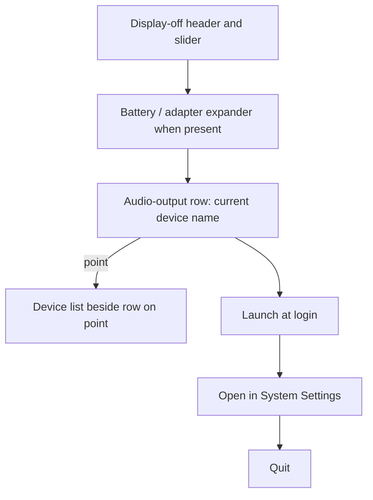
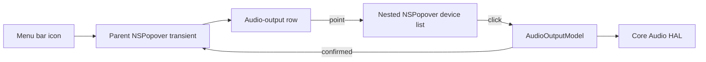
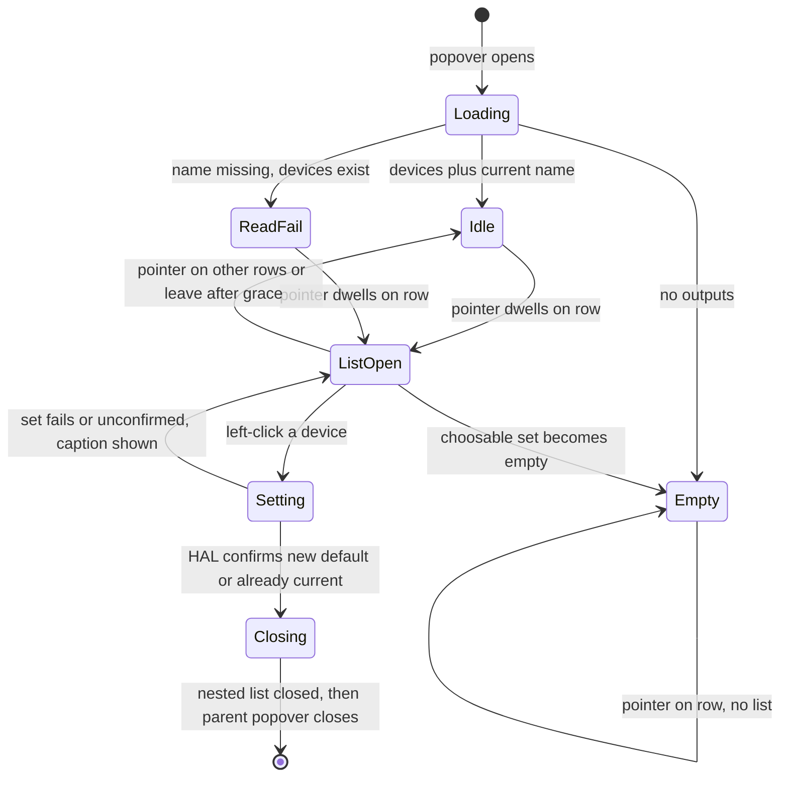

# Audio Output Switcher - Plan

## Goal Capsule

- **Objective:** From NeverSleep's popover, the user can switch the Mac's current audio output in two gestures (point, then click) and the popover closes.
- **Means:** Audio-output row in the existing popover; nested popover list beside the row on point; Core Audio HAL to list and set the default output (KTD1, KTD2).
- **Product authority:** `CONTEXT.md` (menu bar icon + popover; display-off interval, launch at login, quit). This work adds audio-output switching as a second popover capability without changing the display-off workflow.
- **Product Contract preservation:** restructured, no scope change: R7 stays empty-only; R9 splits loading/read-fail out of the empty case; R10 fills unspecified list-dismiss. Clarified R3 as preferred-right with left flip when clipped. Clarified R5 as HAL default-selectable outputs, not extra AirPlay browsing.
- **Open blockers:** none.
- **Stop if:** setting the default output is denied under a signed Release sandbox with no documented entitlement. Do not ship a read-only list, and do not turn App Sandbox off to make the write succeed. Also stop if, after the KTD1 fallback order, the pointer still cannot enter the list without dismissing the parent. Do not ship an in-popover expander, a status-item menu, or a permanently non-transient parent.

---

## Product Contract

### Summary

Add one audio-output row to NeverSleep's existing popover.
Pointing at the row opens a device list beside the row; a left click selects that output and closes the popover.

### Problem Frame

Switching audio output today means Control Center → Sound → the device list.
That is several steps for a change the user makes while already in NeverSleep.
NeverSleep currently has no audio-output surface; the popover only changes the display-off interval, launch at login, and quit.

### Key Decisions

- **Keep the switcher inside the existing popover, not on the menu bar icon.** The user already opens NeverSleep; a second icon menu would split the product into two entries. (session-settled: user-approved — chosen over icon-direct device menu: user confirmed the popover-row approach after seeing the icon-menu alternative.) Governs R1.
- **Open the list by pointing, beside the row.** Preferred edge is right; flip left when that edge would clip. Matches the requested Control Center-like path. (session-settled: user-directed — chosen over in-popover expander: user specified hover-then-right-list and confirmed it over the DisclosureGroup pattern.) Governs R3, R4.
- **Selecting a device closes the whole popover.** Confirmed as the smallest complete switch. (session-settled: user-directed — chosen over leaving the popover open: user said 选完关闭面板.) Governs R6.
- **Idle row shows the current output device name.** Default so the user sees the active route without pointing. Governs R2.
- **List the outputs that can be the system default right now.** Aligns with Control Center Sound's currently selectable HAL devices, including AirPlay when it is already a default-selectable HAL device. Extra AirPlay browsing is out of scope. Governs R5.

### Requirements

**Placement and idle row**

- R1. The audio-output control lives as a row inside the existing NeverSleep popover, alongside the display-off, launch-at-login, and quit controls.
- R2. When the list is not open, the row shows the name of the Mac's current audio output device.
- R9. While devices are still being read, the row shows a loading label and pointing does not open a list. If the current name cannot be read but devices exist, the row shows a read-failure label and pointing still opens the list. R7 applies only when the choosable set is empty.

**Opening the list**

- R3. Pointing at the row opens the output-device list beside the row, preferred edge right. Flip left when the right edge would clip. A right-side menu bar icon will often show the left placement.
- R4. While the pointer travels from the row into the list, the popover stays open and the list stays available.
- R10. The list closes without changing output when the pointer is over other popover content, when it leaves both the row and the list after a short grace for the gap, or when the popover itself dismisses.

**Devices and selection**

- R5. The list contains every audio output that can be the system default at that moment, including built-in speakers, display audio, connected Bluetooth, USB interfaces, and AirPlay destinations that already appear as default-selectable HAL devices.
- R6. A left click on a listed device sets that device as the system audio output and then closes the popover.

**Failure and empty states**

- R7. If no output devices can be listed, the row still appears and explains that none are available; pointing does not open an empty list.
- R8. If selecting a listed device fails, the popover stays open, the current-device name on the row does not change, and the user is told the switch did not take.

### Actors

- A1. The Mac user who already uses NeverSleep's menu bar popover.
- A2. macOS audio-output routing (the system list of choosable outputs and the current default output).

### Key Flows

- F1. Switch output from NeverSleep
  - **Trigger:** A1 has the popover open and wants a different output.
  - **Actors:** A1, A2
  - **Steps:** A1 reads the current device name on the row; points at the row; the list opens beside the row (right, or left if clipped); A1 left-clicks a device; A2 becomes that output; the popover closes.
  - **Covered by:** R1, R2, R3, R4, R5, R6

```mermaid
flowchart TB
  popover[Popover open]
  row[Audio-output row shows current device]
  hover[Pointer enters row]
  list[Device list opens beside the row]
  click[Left-click a device]
  switched[System output changes]
  closed[Popover closes]
  popover --> row --> hover --> list --> click --> switched --> closed
```

- F2. Pointer crosses into the list
  - **Trigger:** The list is open and A1 moves from the row toward a device.
  - **Actors:** A1
  - **Steps:** The pointer leaves the row and enters the list; the popover does not dismiss; the list remains; A1 can still click a device.
  - **Covered by:** R4, R10

- F3. Failed or empty switch
  - **Trigger:** A2 has no choosable outputs, or a listed selection does not apply.
  - **Actors:** A1, A2
  - **Steps:** If none can be listed, A1 sees that on the row and no list opens. If a click fails, the popover stays, the row still shows the previous device, and A1 sees that the switch failed.
  - **Covered by:** R7, R8

- F4. Loading and read-fail
  - **Trigger:** The popover has just opened, or the current name cannot be read while devices exist.
  - **Actors:** A1, A2
  - **Steps:** While the list is still being read, the row shows a loading label and pointing does not open a list. If the name cannot be read but devices exist, the row shows a read-failure label and pointing still opens the list.
  - **Covered by:** R9

### Visualizations

Placement of the new row relative to existing popover content:



### Acceptance Examples

- AE1. Happy path
  - **Covers R2, R3, R5, R6.**
  - **Given:** The popover is open and more than one output is choosable.
  - **When:** A1 points at the audio-output row and left-clicks another listed device.
  - **Then:** That device becomes the system audio output and the popover closes.

- AE2. Current device visible without pointing
  - **Covers R2.**
  - **Given:** The popover is open and the list is closed.
  - **When:** A1 looks at the audio-output row.
  - **Then:** The row shows the current output's name.

- AE3. Pointer can reach the list
  - **Covers R4, R10.**
  - **Given:** The device list is open beside the row.
  - **When:** A1 moves the pointer from the row into the list.
  - **Then:** The popover stays open and the list stays available until a selection or an intended dismiss.

- AE4. No devices
  - **Covers R7.**
  - **Given:** The system currently has no choosable audio outputs.
  - **When:** A1 opens the popover and points at the audio-output row.
  - **Then:** The row explains that none are available and no list opens.

- AE5. Selection fails
  - **Covers R8.**
  - **Given:** A listed device cannot be applied as the system output.
  - **When:** A1 left-clicks that device.
  - **Then:** The popover stays open, the row still shows the previous device, and A1 is told the switch did not take.

- AE6. Loading is not empty
  - **Covers R9.**
  - **Given:** The popover has just opened and the device list has not arrived.
  - **When:** A1 looks at the row and points at it.
  - **Then:** The row shows a loading label and no list opens.

- AE7. List closes without a selection
  - **Covers R10.**
  - **Given:** The device list is open.
  - **When:** A1 moves the pointer onto launch-at-login, or leaves both the row and the list after the grace.
  - **Then:** The list closes, output is unchanged, and the popover stays open.

### Scope Boundaries

**In this work**

- Switching the current system audio output from the NeverSleep popover via a point-then-click list.

**Deferred for later**

- Volume control
- Audio input device switching
- Opening a device list directly from the menu bar icon without the popover

**Outside this product's identity**

- A general audio mixer, per-app output routing, or a Control Center replacement

**Deferred to Follow-Up Work**

- Sound Settings deep link on empty or failed audio rows
- VoiceOver-only activation of the row without a pointer

### Dependencies / Assumptions

- macOS exposes a user-selectable list of current audio outputs and a way to change the default output from a sandboxed menu-bar app. Planning confirms the API and any entitlement; product behavior does not wait on a specific framework.
- "Every output the system can select at that moment" means HAL devices that can be the default output (alive, output-scope streams, `kAudioDevicePropertyDeviceCanBeDefaultDevice` on output scope, not hidden). AirPlay is included only when it already appears as such a HAL device. Extra AirPlay browsing is out of scope.
- Display-off interval, launch at login, and quit keep their current behavior.

### Outstanding Questions

**Deferred to Planning** — resolved in the Planning Contract.

**Deferred to implementation**

- Exact hover open-delay and close-grace durations for the row-to-list gap.
- Exact empty, loading, read-fail, write-fail, and in-flight copy (EN + zh-Hans), matching existing caption tone.
- Exact unconfirmed-set wait before R8 (same class as hover grace: implementation-defined, finite).

### Sources / Research

- `CONTEXT.md` — product language: menu bar icon, popover, display-off interval; popover currently changes display-off, launch at login, and quit.
- `NeverSleep/PopoverView.swift` — 300-point popover: slider, battery/adapter DisclosureGroup, launch-at-login, System Settings deep link, Quit.
- `NeverSleep/AppDelegate.swift` — NSStatusItem + transient NSPopover; no status-item NSMenu.
- `docs/verification.md` — current manual checks for popover open/dismiss, login, quit; no audio coverage yet.
- Repo search: no CoreAudio / AVAudio / AudioDevice / output-switching code; no prior plan under `docs/plans/` or `docs/brainstorms/`.
- Core Audio HAL: `kAudioHardwarePropertyDevices` to list, `kAudioHardwarePropertyDefaultOutputDevice` to get/set on `kAudioObjectSystemObject`. AirPlay appears as HAL devices with AirPlay transport when choosable.
- `NSPopover.Behavior.transient` dismisses on outside click or app deactivation, not on pointer exit. Nested popovers are supported.

---

## Planning Contract

### Key Technical Decisions

- KTD1. **Show the device list in a nested `NSPopover` anchored to the row, preferred edge right, proof-gated on the live parent.** A second independent window would sit outside the parent and fight `.transient`. An in-popover expander was rejected as product. `NSMenu.popUp` is click-native, not hover-native. Nested popovers are documented, but not with this accessory + `makeKey()` + `.transient` parent, so U2 must prove hover-open, pointer travel, parent stays, and outside click still closes the parent on the real status-item popover. Default nested config: `.applicationDefined`, do not `makeKey()` the nested window, track the pointer with areas that fire when the nested window is not key, and accept first mouse so the first click selects. Fallback if nested show still dismisses the parent: (1) parent `.applicationDefined` only while the list is open, with an event monitor so outside click still `performClose`s the parent, then restore `.transient`; (2) flyout as a child window of the parent popover window, only while parent is `.applicationDefined`, with the same outside-click monitor. If the pointer still cannot enter the list, stop per Goal Capsule. (session-settled: user-directed — chosen over in-popover expander: user specified hover-then-right-list.) Instantiates R3, R4, R10.
- KTD2. **List, read, and set default output through Core Audio HAL on the system object.** Set `kAudioHardwarePropertyDefaultOutputDevice`, not the system-sounds default. This is the supported path used by SwitchAudioSource. AVFoundation does not set the system default output. Instantiates R5, R6.
- KTD3. **Own device data in a sibling `AudioOutputModel`, not on `DisplayOffModel`.** AppDelegate injects it into the hosting graph. The model owns devices, current name, loading/empty/read-fail, and set result. ListOpen, hover grace, and dismiss stay in the popover session. HAL listeners run only while the parent popover is shown. Instantiates R2, R5, R8, R9.
- KTD4. **Dismiss only after a confirmed select, nested list first.** If the clicked device is already the default, treat as confirmed and dismiss without waiting. If the HAL set returns non-zero, apply R8 immediately. Otherwise wait until the default-output listener matches the chosen device; if it does not confirm, apply R8 as unconfirmed. On confirmed dismiss: close the nested list (and any child-window flyout) first, then `performClose` the parent. Parent `performClose` is invalid while a nested popover or child window is attached. Instantiates R6, R8.
- KTD5. **Prefer right; flip the nested popover left when the right edge would clip; cap height and scroll when the list would clip the bottom.** Status items sit on the right of the menu bar. Instantiates R3.

### High-Level Technical Design





One popover session (AppDelegate) owns parent show/hide, nested show/hide, KTD5 flip, hover open-delay and close-grace, parent-will-close → nested close, and KTD4 dismiss.
Views report pointer enter/exit and click through a row-anchor view; they do not create `NSPopover`s.
Parent stays `.transient` unless fallback rung 1 is active. Nested behavior is `.applicationDefined`. Do not `makeKey()` the nested window. Track the pointer with areas that fire when the nested window is not key, and accept first mouse.
Pointer travel is not an outside click, but the accessory `makeKey()` path can still steal the parent; U2 proves this on the live status item.
Hover open-delay covers accidental crossing of the row toward login or Quit. Close-grace covers only the row-to-list gap. Recompute parent `contentSize` from fitting size on show; do not widen the 300-point frame to fake a side list.
Cap the nested list to remaining visible height and scroll overflow.

### Assumptions

- Setting `kAudioHardwarePropertyDefaultOutputDevice` works from a signed Release sandbox without a new entitlement. U1 must prove this before UI lands. If it is denied and no documented entitlement exists, stop per Goal Capsule.
- Clicking the already-current device still counts as R6 and closes the popover.
- A single choosable output still opens a one-item list. R7 is zero devices only.
- Current name and list update live while the popover is open. HAL listeners start on parent show and stop on parent close. A click on a vanished device is R8. An open list that becomes empty closes and shows R7.
- Failure copy is a red caption under the audio row, matching write/login errors. The list stays open. No Sound Settings link. Unconfirmed sets after the wait in KTD4 apply R8.
- Current device in the list uses a checkmark. Duplicate names append transport (Bluetooth / USB / AirPlay).
- Chinese catalog keys, EN + zh-Hans, same tone as existing captions (`读取中…`, `无法读取`).
- No XCUI coverage for hover. Unit tests cover HAL mapping helpers. Manual checks go in `docs/verification.md`.

### Implementation Constraints

- Follow live files, not the stale `AGENTS.md` ContentView graph.
- New Swift files under `NeverSleep/` and `NeverSleepTests/` are folder-synced; do not edit `project.pbxproj` just to add sources.
- App Sandbox remains off in Debug and on in Release. Do not disable Release sandbox to unblock HAL writes.
- If an entitlement is required and documented, add an entitlements file and set `CODE_SIGN_ENTITLEMENTS` for both configurations.
- Keep process/HAL I/O out of views. Mark mapping helpers `nonisolated` for Swift Testing.
- Product copy uses **popover** and **menu bar icon**, never dropdown, popup, or tray.

### Sequencing

U1 (model + sandbox proof) before U2 (nested popover + dismiss).
U2 first proof is the live parent (accessory, `makeKey()`, `.transient`, outside-click still works). Record which KTD1 fallback rung shipped. Do not start U3 if R4 fails after that order.
U2 before U3 (row UI).
U4 (docs) after the UI exists so verification steps match the shipped interaction.

---

## Implementation Units

### U1. Audio output model and HAL mapping

- **Goal:** NeverSleep can list choosable outputs, read the current default name, and set a new default through Core Audio HAL.
- **Requirements:** R2, R5, R6, R7, R8, R9
- **Dependencies:** none
- **Files:**
  - Create `NeverSleep/AudioOutputModel.swift`
  - Create `NeverSleepTests/AudioOutputModelTests.swift`
- **Approach:**
  1. Add a sibling `@Observable` model. AppDelegate injects it; do not fold HAL into `DisplayOffModel`.
  2. Enumerate `kAudioHardwarePropertyDevices`. Keep a device only when it is alive, has output-scope streams, is not hidden, and `kAudioDevicePropertyDeviceCanBeDefaultDevice` is true for output scope.
  3. Include AirPlay transport only when that device already passes the filter. Do not invent extra AirPlay browsing.
  4. Read and set `kAudioHardwarePropertyDefaultOutputDevice` on the system object, not the system-sounds default.
  5. Expose pure `nonisolated` helpers for output filtering, display name, duplicate-name disambiguation, and mapping set results to success, already-current, or failure.
  6. Register HAL listeners from the popover session show/close path (U2). Listener callbacks are not MainActor; hop to MainActor before mutating the model.
- **Execution note:** First proof is a signed Debug list/get/set against real devices, then the same set under a signed Release `.app` (not Debug tests). Compare the filtered list to Control Center Sound on the proof Mac and record mismatches, including AirPlay. Stop if Release set is denied and no documented entitlement exists.
- **Patterns to follow:** `DisplayOffModel` ownership, `parsePmsetCustom` / `NeverSleepTests/DisplayOffModelTests.swift` for pure helpers.
- **Test scenarios:**
  - Covers AE4. Filter helper given only input-capable IDs returns empty.
  - Filter helper given mixed input/output IDs returns only output-capable IDs.
  - Duplicate names with Bluetooth and USB transports become distinct display strings.
  - AirPlay transport is kept only when it also can be the default output.
  - Hidden or non-defaultable output devices are dropped.
  - Set-result mapper treats a non-zero HAL status as failure and does not report a new current name.
  - Set-result mapper treats an already-current device as confirmed success.
  - Current-name helper returns loading/empty/read-fail tokens distinct from a real device name.
- **Verification:** Unit tests pass. Manual Debug set changes the system default. Release sandbox set either succeeds or stops the pipeline per Goal Capsule.

### U2. Nested device-list popover and parent dismiss

- **Goal:** Pointing at an anchor view opens a nested popover beside the row that the pointer can enter, and a confirmed selection can close the parent popover.
- **Requirements:** R3, R4, R6, R8, R10. KTD1, KTD4, KTD5
- **Dependencies:** U1
- **Files:**
  - Modify `NeverSleep/AppDelegate.swift`
  - Create `NeverSleep/AudioOutputListView.swift`
  - Create a small row-anchor representable under `NeverSleep/` that reports its `NSView` and bounds
- **Approach:**
  1. Keep the parent `NSPopover` `.transient` unless fallback rung 1 is active.
  2. Own nested show/hide in the same AppDelegate session as the parent. Nested behavior `.applicationDefined`; do not `makeKey()` the nested window.
  3. Show from the row-anchor view with preferred edge max-X; flip to min-X when the right side would clip; cap height and scroll (KTD5).
  4. Inject `AudioOutputModel` beside `DisplayOffModel`. Start and stop HAL listeners on parent show/close.
  5. Confirmed dismiss closes the nested list first, then `performClose`s the parent (KTD4). Parent will-close still closes the nested list on outside dismiss.
  6. Recompute parent `contentSize` from fitting size when showing; the 300-point width stays.
  7. Open-delay before showing the list; cancel if the pointer leaves toward other parent content. Close-grace covers only the row-to-list gap. Pointer over other parent content closes the nested popover (R10).
  8. Track the nested list with areas that fire when it is not key, and accept first mouse so the first click selects.
  9. If nested show dismisses the parent, walk the KTD1 fallback order and record the rung that shipped (default, parent-applicationDefined, or child-window plus parent-applicationDefined).
- **Patterns to follow:** `AppDelegate` status-item + popover ownership; `NSApp.activate()` before show so the panel still appears over fullscreen.
- **Test scenarios:**
  - Covers AE3. Pointer travel from row into nested list does not close the parent.
  - Covers AE7. Pointer onto launch-at-login closes the nested list and leaves the parent open.
  - Confirmed set closes the nested list, then the parent. Failed set does neither.
  - Nested popover flips left when the status item is against the right screen edge.
  - First click on a non-key nested list selects a device rather than only focusing the window.
- **Verification:** Manual: open NeverSleep, point at the future row anchor, list appears to the right (or left if clipped), pointer can enter, outside click still dismisses the parent.

### U3. Audio-output row, list UI, and copy

- **Goal:** The popover shows the current output name, opens the nested list on point, and selects a device on left click.
- **Requirements:** R1, R2, R3, R5, R6, R7, R8, R9, R10. F1, F3, F4. AE1, AE2, AE4, AE5, AE6
- **Dependencies:** U1, U2
- **Files:**
  - Modify `NeverSleep/PopoverView.swift`
  - Modify `NeverSleep/Localizable.xcstrings`
- **Approach:**
  1. Insert a Divider-bounded audio section after the display-off block and before launch-at-login. Do not put it inside the battery DisclosureGroup.
  2. Idle row matches the display-off header: leading speaker icon, static title, trailing current-device name or loading/empty/read-fail token. No disclosure chevron.
  3. Loading and empty rows use tertiary/secondary caption treatment and no hover highlight. Read-fail keeps idle chrome and still opens the list.
  4. Pointing after open-delay opens the nested list from U2. List rows show system names, checkmark on current, transport suffix on duplicates.
  5. Left click enters Setting: chosen row shows progress, further clicks are ignored, list stays open. Confirmed dismisses via U2. Failure shows a red caption under the row, re-enables the list, and keeps it open (R8).
  6. Add Chinese source keys with EN and zh-Hans, same caption tone as display-off errors.
- **Patterns to follow:** `PopoverView` VStack spacing 14, width 300, red `.caption` errors, `#Preview` with `.environment`.
- **Test scenarios:**
  - Covers AE1. Point, click another device, system output changes, popover closes.
  - Covers AE2. Idle row shows current name without pointing.
  - Covers AE4. Empty choosable set shows empty copy and does not open a list.
  - Covers AE5. Failed set keeps popover, name, and a red caption.
  - Covers AE6. Loading label, no list.
  - One-item list still opens on point.
  - Clicking the current device closes the popover.
- **Verification:** Display-off, login, and quit still work. Unit tests from U1 still pass. Manual audio checks are listed in U4 and executed after U4 writes them.

### U4. Product language and manual verification

- **Goal:** Glossary and the verification checklist name the new capability.
- **Requirements:** R1–R10
- **Dependencies:** U3
- **Files:**
  - Modify `CONTEXT.md`
  - Modify `docs/verification.md`
- **Approach:**
  1. Add glossary terms for audio output / current output device. Keep popover and menu bar icon wording.
  2. Extend Relationships so the popover also switches audio output.
  3. Add manual checks: idle name, hover-open, pointer travel, list-closes-without-selection, flip-if-clipped, select-closes, empty, loading, failed set, one-item list, in-flight wait, no regression of existing checks. Cover two-output, empty, loading, and failed-set on separate runs where needed.
- **Test expectation:** none -- documentation only.
- **Verification:** CONTEXT terms match the shipped row. Verification checklist can be executed on a Debug build.

---

## Verification Contract

- Unit: `xcodebuild test -project NeverSleep.xcodeproj -scheme NeverSleep -destination 'platform=macOS' -only-testing:NeverSleepTests`
- Debug build: `xcodebuild -project NeverSleep.xcodeproj -scheme NeverSleep -configuration Debug build`
- Release sandbox proof (U1): signed Release `.app`, not a bare binary, set default output and confirm `kAudioHardwarePropertyDefaultOutputDevice` changed.
- Manual: `docs/verification.md` audio section plus existing popover open/dismiss, login, and quit checks.
- Do not add XCUI hover coverage.

---

## Definition of Done

- U1–U4 complete against their verification fields.
- Happy path AE1–AE3, AE6, AE7 hold on a Debug run with at least two outputs. AE4 (empty) and AE5 (failed set) are verified on dedicated runs, not that two-output session.
- Release sandbox set either works or the run stopped per Goal Capsule.
- Display-off slider, launch at login, and quit are unchanged.
- Abandoned experiments (detached windows, NSMenu popUp, DisplayOffModel piggyback, SwiftUI nested `.popover`, parent left on `.applicationDefined`) are not in the diff.
- U2 records which KTD1 fallback rung shipped. If R4 cannot be met, the run stopped instead of shipping U3.
- `CONTEXT.md` and `docs/verification.md` describe the shipped behavior.

---

## Risks & Dependencies

- **Release sandbox may deny HAL set.** Mitigation: prove in U1 before UI. No sandbox-off workaround.
- **AirPlay/Bluetooth set may be asynchronous.** Mitigation: Setting state plus KTD4 wait; unconfirmed after the wait is R8.
- **Nested popover vs `.transient`.** Mitigation: KTD1 fallback order. Prove on the live accessory parent, not a demo window. Do not leave the parent on `.applicationDefined` after the list closes. If R4 still fails, stop.
- **Right-edge clipping.** Mitigation: KTD5.

## Alternative Approaches Considered

- **In-popover DisclosureGroup.** Rejected: product Key Decision.
- **Status-item `NSMenu`.** Rejected: product Key Decision.
- **Detached `NSPanel` for the list.** Rejected: outside the transient popover, accessory-app activation risk.
- **Widen the parent popover and draw the list inside.** Rejected: changes the 300-point panel and is not a list beside the row.
